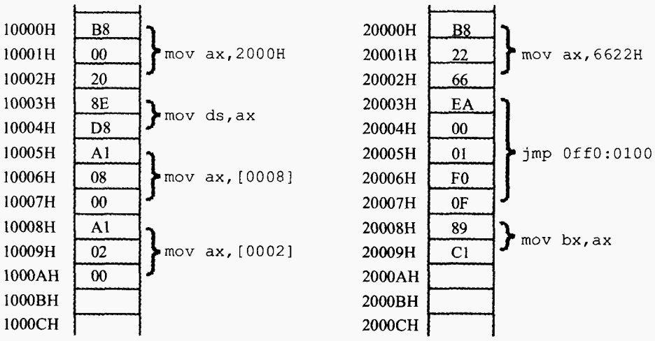
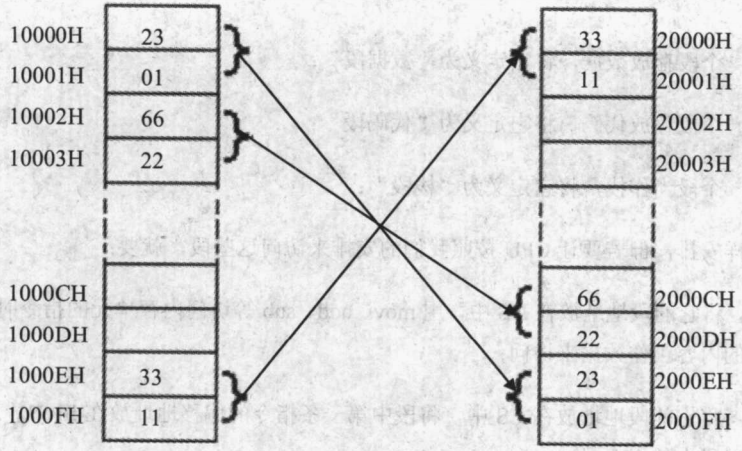

### 检测点3.1
**（1）在Debug中用"d 0:0 1f"查看内存，结果如下：**
```bash
    0000:0000  70 80 F0 30 EF 60 30 E2-00 80 80 12 66 20 22 60
    0000:0010  62 26 E6 D6 CC 2E 3C 3B-AB BA 00 00 26 00 66 88
```
**下面的程序执行前，AX=0,BX=0，写出每条汇编指令执行完后相关寄存器中的值。**
>答：
>```bash
>mov ax,1
>mov ds,ax
>mov ax,[0000]   AX=2662H
>mov bx,[0001]   BX=E626H
>mov ax,bx       AX=E626H
>mov ax,[0000]   AX=2662H
>mov bx,[0002]   BX=D6E6H
>add ax,bx       AX=FD48H
>add ax,[0004]   AX=2C14H
>mov ax,0        AX=0000H
>mov al,[0002]   AX=00E6H
>mov bx,0        BX=0000H
>mov bl,[000C]   BX=0026H
>add al,bl       AX=000CH
>```

**(2)内存中的情况如图所示**

**各寄存器的初始值：CS=2000H，IP=0，DS=1000H，AX=0，BX=0；**

**① 写出CPU执行的指令序列（用汇编指令写出）。**

**② 写出CPU执行每条指令后，CS、IP和相关寄存器中的数值。**

**③ 再次体会：数据和程序有区别吗？如何确定内存中的信息哪些是数据，哪些是程序？**
> 答：①②的结果如下
> ```bash
>mov ax,6622     CS=2000H，IP=0003H，AX=6622H
>jmp 0ff0:0100   CS=0FF0H，IP=0100H
>mov ax,2000     CS=0FF0H，IP=0103H，AX=2000H
>mov ds,ax       CS=0FF0H，IP=0105H，DS=2000H
>mov ax,[0008]   CS=0FF0H，IP=0108H，AX=C189H
>mov ax,[0002]   CS=0FF0H，IP=010BH，AX=EA66H
>```
> ③在磁盘和内存中，数据和程序没有区别，都是二进制信息；<br/>
> 要确定内存中的信息是程序或数据，主要看访问信息的寄存器类型：<br/>
> 当CS:IP访问这些信息时，信息就是程序指令；<br/>
> 其他的情况，信息都被当作数据。

### 检测点3.2
**（1）补全下面的程序，使其可以将10000H~1000FH中的8个字，逆序拷贝打20000H~2000FH中。逆序拷贝的含义如图所示（图中内存里的数据均为假设）：**

>答：
>```bash
>mov ax,1000
>mov ds,ax
>mov ax,2000
>mov ss,ax
>mov sp,0010
>push [0]
>push [2]
>push [4]
>push [6]
>push [8]
>push [A]
>push [C]
>push [E]
>```

**（2）补全下面的程序，使其可以将10000H~1000FH中的8个字，复制到打20000H~2000FH中。**
>答：
>```bash
>mov ax,2000
>mov ds,ax
>mov ax,1000
>mov ss,ax
>mov sp,0
>push [E]
>push [C]
>push [A]
>push [8]
>push [6]
>push [4]
>push [2]
>push [0]
>```

### 实验任务
**（1）使用Debug将下面的程序段写入内存，逐步执行，根据指令执行后的实际运行情况天空。**
>答：
>```bash
>mov ax,ffff
>mov ds,ax
>mov ax,2200
>mov ss,ax
>mov sp,0100
>mov ax,[0]     ax=C0EA
>add ax,[2]     ax=C0FC
>mov bx,[4]     bx=30F0
>add bx,[6]     bx=6021
>push ax        sp=00FE;修改的内存单元的地址是220FE,内容为C0FC
>push bx        sp=00FC;修改的内存单元的地址是220FC,内容为6021
>pop ax         sp=00FE;ax=6021
>pop bx         sp=0100;bx=C0FC
>push [4]       sp=00FE;修改的内存单元的地址是220FE内容为30F0
>push [6]       sp=00FC;修改的内存单元的地址是220FC内容为2F31
>```